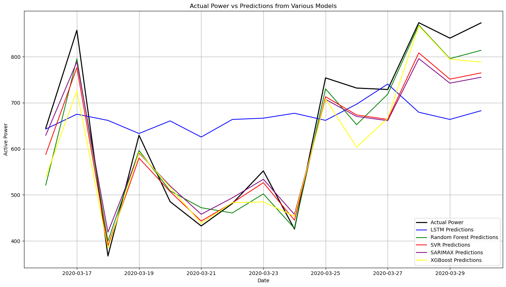
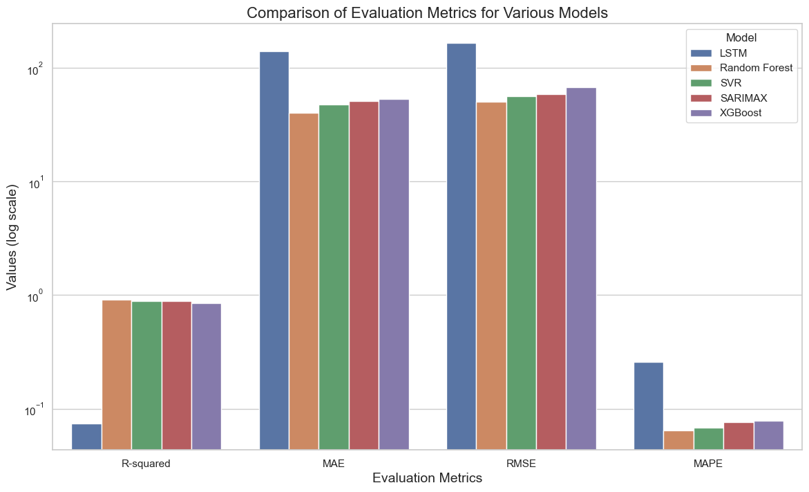

# Wind Power Forecasting

This repository contains a comprehensive study of **short-term wind power forecasting** using five models:

- **SARIMAX** (statistical model)
- **Support Vector Regression (SVR)**
- **Random Forest**
- **XGBoost**
- **Long Short-Term Memory (LSTM)**

The goal is to identify the most accurate and computationally efficient model for daily wind power prediction based on meteorological features.

---

## Repository Structure

```
├── data/
│   └── Turbine_Data.csv
├── results/
├── Wind_Power_Prediction.ipynb
├── README.md
└── LICENSE
```

---

## Model Comparison Summary

We trained and tested all five models on a publicly available wind turbine dataset from Kaggle. The dataset includes Active Power, Wind Speed, Direction, Temperature, Pressure, and Humidity, recorded at 10-minute intervals and aggregated to daily level for day-ahead forecasting.

Key evaluation metrics:

- **R² (Goodness of Fit)**
- **MAE (Mean Absolute Error)**
- **RMSE (Root Mean Squared Error)**
- **MAPE (Mean Absolute Percentage Error)**

### Results: All Models Overlayed



Random Forest provided the best fit to actual values, with SVR and SARIMAX also showing competitive performance. LSTM struggled due to limited granularity in the daily dataset.

---

### Metrics Comparison (Log Scale)



- **Random Forest** outperformed all other models in accuracy and consistency.
- **SVR** performed well despite being linear.
- **LSTM** underperformed due to coarse daily aggregation and insufficient temporal data.

---

## Conclusion

Random Forest proved to be the most reliable choice for short-term wind power forecasting with limited data. While LSTM has potential in high-frequency contexts, it is not suitable for daily aggregated datasets without significant volume.

---

## Future Work

- Use high-frequency (10-min) or hourly data for LSTM/GRU-based models
- Explore hybrid models combining statistical + ML/DL approaches
- Add probabilistic forecasting to assess prediction uncertainty

---

## License

This project is licensed under the MIT License. See the [LICENSE](./LICENSE) file for more details.
